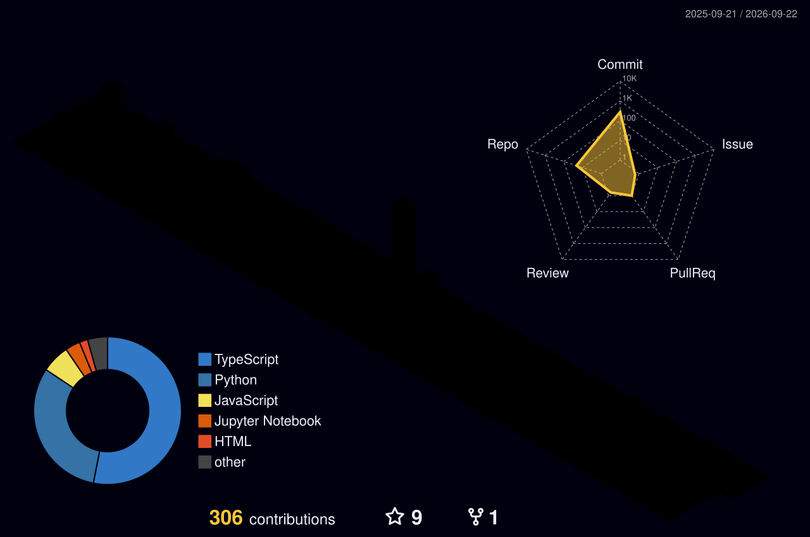

  

### About Me

I am an **Electrical Engineering undergraduate at IIT Jodhpur**, bridging the gap between **Full Stack Web Development** and **Autonomous Robotics**. My work focuses on building scalable web infrastructure and simulating intelligent multi-robot systems.

* **Web Development:** Specializing in the **MERN Stack** to build robust data-driven applications.
* **Robotics:** Engineering autonomous navigation systems using **ROS2, Gazebo, and SLAM**.
* **Product Vision:** Leveraging data science and product management principles to solve real-world industrial problems.
---
##  Recent Posts
-  **[INTER IIT TECH 13.0 – 5th POSITION IN ROBOTICS PROBLEM STATEMENT](https://www.linkedin.com/posts/nandiniramnani_interiit-interiittechmeet13-robotics-ugcPost-7274443007708270592-8uTe?utm_source=share&utm_medium=member_desktop&rcm=ACoAAE9sk38BOxneRcfGG3ETCqvYW7gF-WkUSZc)**

## Socials:
   

## GitHub Stats:
<table>
  <tr>
    <td valign="top" width="50%" align="center">
      
      
    </td>
    <td valign="top" width="50%">
      
      
    </td>
  </tr>
</table>
